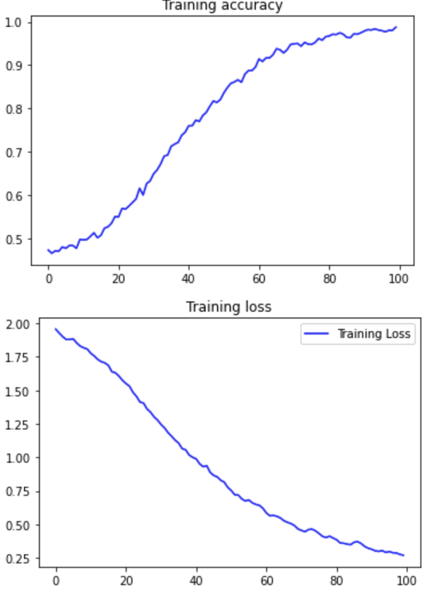

# Automatic music generation with sonic Pi and Recurrent Neuronal Networks (RNNs)

Sonic Pi is a code-based music creation and performance tool and it is really awesome, rather than me writing check this
[video](https://www.youtube.com/watch?v=G1m0aX9Lpts) out to see it in action.

Lately, I have been learning the main concepts of RNNs thanks to this great [course](https://www.coursera.org/specializations/tensorflow-in-practice)  by the one and only [Laurence Moroney](http://www.laurencemoroney.com/), so, the question is clear:
Can I build a RNN that automatically generates sonic Pi music code?

## The data

There is plenty of sonic Pi code avaiable on github, I have came across this great [repo](https://gist.github.com/rbnpi) by Robin Newman.   After searching a bit I have selected [this](https://gist.github.com/rbnpi/8785fd93087ca115ff2799f8bd72153c) piece by Purcell.  
You can listen it on [soundCloud](https://soundcloud.com/user-195236670/play-purcell)  
**How can we auto generate the code?**  
sonic Pi has a lot of nice features and ways to code, but this particulary example i have selected is nice and suitable for ML as the code follows the next pattern:
```
a1=[]
b1=[]
a1[0]=[:C3,:B2,:G2,:r,:r,...,:Ef5,:D5,:Ef5,:C3,:B2,:G2,:r,:r,:Bf3,:Ef3,:D3,:B2,:C3,:Ef3,:F3,:G3,:r]
b1[0]=[0.5,0.5...2.0]
c1=[70]
in_thread do
  for i in 0..a1.length-1
    use_bpm c1[i]
    for j in 0..a1[i].length-1
      play a1[i][j],sustain: b1[i][j]*0.9,release: b1[i][j]*0.1
      sleep b1[i][j]
    end
  end
end
```
Where:

* **a** is the notes list
* **b** is the notes duration list
* **c** is the BPM  

To make things easier we are going to only try to learn the notes list, leaving the duration and the bpm static. So I have created a training set extracting the notes list. Training data is on the ```train_data.rb``` file

## The model

Tokenizer wise we can go full ahead with word_tokens (not char) as the corpus size is relatively small.  
Below is the architecture used for training the model
```
_________________________________________________________________
Layer (type)                 Output Shape              Param #   
=================================================================
embedding_1 (Embedding)      (None, 1225, 100)         3400      
_________________________________________________________________
bidirectional_1 (Bidirection (None, 1225, 300)         301200    
_________________________________________________________________
dropout_1 (Dropout)          (None, 1225, 300)         0         
_________________________________________________________________
lstm_3 (LSTM)                (None, 100)               160400    
_________________________________________________________________
dense_2 (Dense)              (None, 17)                1717      
_________________________________________________________________
dense_3 (Dense)              (None, 34)                612       
=================================================================
Total params: 467,329
Trainable params: 467,329
Non-trainable params: 0
```
After doing some tests, the model converges nicely with 100 epochs:
 

Time to run some predictions then! Lets start with a couple of notes ```AF5,C4``` and ask the network to generate 5000 more notes

## The results

So we have the prediction back. How will it sound? 

[Listen to the results](https://soundcloud.com/luis-velasco-11/full-ml-melody)

Honestly this is way ahead of my expectations! I particulary like that nice melody on the seconds 26-31, so I have extracted the code, change the synth and add some beats on the background:

[ML loop](https://soundcloud.com/luis-velasco-11/machine-learnig-created-loop)

Yes, I have also think this is the next hit of this summer! :)


